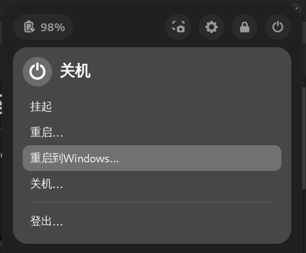

# Reboot to Windows / 重启到Windows

This is a small Gnome extension that adds the ability to reboot directly to the Windows when using grub.

此Gnome扩展允许您从重启菜单中一键重启到Windows。

# 警告

**此插件不在Gnome扩展站点上提供！**

#### Q：为什么此插件不在Gnome扩展商店提供？

A：此插件不符合Gnome扩展开发规范，其调用了本地的脚本文件实现。

#### Q：为什么不按照开发规范开发此插件？

A：很抱歉，在过去的3天中，我尝试了所有我能尝试的方法来将脚本文件嵌入到`extension.js`文件中，但是最终都以失败告终。其中包括但不限于：大量的转义字符，缺乏subprocesses函数相关的文档。
如果您有相关开发经验，能为此插件制作满足开发规范的版本，感激不尽。

#### Q：现在插件是如何实现的？

A：插件会在您执行安装脚本（`install.sh`）时在用户目录下生成一个shell程序，此后当您执行此插件时，该脚本会被调用。

#### Q：我安装了插件后没有出现该菜单？

A：Gnome可能默认关闭了所有扩展，请在你的程序库中找到`扩展`启用扩展功能，并启用reboot2win扩展。

# Warning
**This plugin is not available on the Gnome Extensions website!**

#### Q: Why is this plugin not available on the Gnome Extensions store?

A: This plugin does not comply with the Gnome Extensions development guidelines as it calls local script files.

#### Q: Why wasn't this plugin developed according to the guidelines?

A: I apologize, but over the past three days, I have tried every method I could think of to embed the script file into the extension.js file, but all attempts have failed. This includes, but is not limited to, extensive use of escape characters and a lack of documentation on subprocess functions. If you have relevant development experience and can create a version of this plugin that meets the development guidelines, I would greatly appreciate it.

#### Q: How is the plugin currently implemented?

A: When you run the installation script (install.sh), the plugin will generate a shell program in your user directory. Subsequently, when you execute the plugin, that script will be invoked.

#### Q: I installed the plugin, but the menu is not appearing. What should I do?

A: Gnome may have all extensions disabled by default. Please find "Extensions" in your application library, enable extension functionality, and enable the "reboot2win" extension.

### 下载插件
从GitHub克隆该存储库。

`$ git clone https://github.com/Coooolfan/Reboot2Windows`

### 构建插件
要构建插件，请运行以下命令：

`$ sh build.sh`

如果一切顺利，这将在项目文件夹中生成一个zip文件。

### 安装插件
要安装插件，只需运行install.sh脚本，并使用以下命令：

`$ sh install.sh`

### Download the extension

clone this repository from github.

`$ git clone https://github.com/Coooolfan/Reboot2Windows`

### Build the extension

To build the extension run the following command:

`$ sh build.sh`

If all goes well this will generate a zip file in the project folder.

### Install the extension

To install the extension just run the **install.sh** script with the following command:

`$ sh install.sh`

### Acknowledgements

Despite the roughness of this plugin, I am still very grateful to all the friends who have shared their experiences online.

Special thanks to the author of reboottouefi for open-sourcing the plugin at [reboottouefi](https://github.com/UbayGD/reboottouefi). 

I would also like to express my gratitude to the friends within the archlinuxcn community who have generously contributed their time, helping me troubleshoot various issues during the plugin development process.

